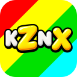

# Kozynax

Kozynax is a cross-platform (Windows / Linux / macOS) ZX Spectrum emulator.

  

It is based on the emulation engine of [ZXMAK2](https://github.com/ZXMAK/ZXMAK2) and combines its pixel-perfect accuracy with portability.

# Downloads

The latest stable version is available in [Releases](https://github.com/kozynax/kozynax/releases/latest).

If you are using Windows, you will most likely want `Kozynax-...-win-x86-winforms.zip` (but you may also try the SDL build, `Kozynax-...-win-x64-sdl.zip`).
Linux builds are available as a simple ZIP archive and a DEB package.
macOS builds are available for arm64 and x64.

## Highlights

- Broad clone support (Pentagon, Scorpion, ATM, Profi, PentEvo, Sprinter, Quorum, Karabas-Pro, Spectrum 48/128/+3, and more)
- Disk / tape / snapshot formats including TRD, SCL, FDI, UDI, HFE, TAP, TZX, Z80, SNA, SZX, RZX, …
- SDL and WinForms UI versions
- Convenient debugger
- Self-contained single-file builds

## License

GNU GPL v2 (or later). See [LICENSE](LICENSE).
